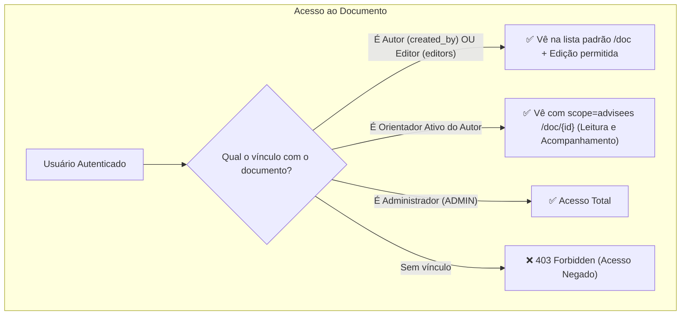

# 🎓 Guia Completo e Amigável de Integração Frontend: Documentos, Autoria e Orientações (Advisorship)

Bem-vindo ao guia de integração do **Lumina Back**! Este documento foi escrito para ser direto, visual e **Human-Friendly**, explicando como consumir a API de documentos e gerenciar relacionamentos acadêmicos de orientação no frontend.

---

## ⚡ TL;DR — O que mudou?

1. **Adeus, Unidades Fixas (`Unit`)**: Antes, os usuários de uma mesma unidade viam os documentos uns dos outros. Isso foi descontinuado.
2. **Nova Regra de Ouro da Listagem de Documentos (`GET /doc`)**:
   * **Padrão**: Você enxerga **apenas os seus documentos** (documentos que você criou como autor ou onde foi adicionado como **editor**).
   * **Orientadores**: Podem filtrar e visualizar os trabalhos dos seus **orientandos ativos**.
   * **Administradores**: Têm visão global de todos os documentos do sistema.
3. **Módulo de Orientação (`/advisorship`)**: Relacionamentos N-N dinâmicos entre Professores/Pesquisadores (Orientador, Coorientador, Membro de Banca) e Alunos/Orientandos.

---

## 🧭 1. Modelo Mental e Regras de Negócio

### 👥 Papéis Contextuais
* **Autor (`created_by`)**: Dono do documento. Pode editar, arquivar, criar releases e excluir.
* **Editor (`DocumentEditor` / `editors`)**: Colaborador no documento. Vê o documento na sua listagem padrão (`GET /doc`), pode editar dados e gerar novas versões.
* **Orientador (`Advisorship`)**: Professor vinculado ao aluno com status `ACTIVE` (`MAIN_ADVISOR`, `CO_ADVISOR`, `EVALUATOR`). Pode ler os documentos do orientando e acompanhar o progresso de revisão.
* **Administrador (`access_level: ADMIN`)**: Acesso irrestrito a todos os documentos e orientações.



---

## 📄 2. Endpoints de Documentos (`/doc`)

> 🔐 **Autenticação**: Todos os endpoints exigem o cabeçalho `Authorization: Bearer <token_jwt>`.

---

### 2.1. Listar Documentos — `GET /doc`

Retorna a lista de documentos acessíveis pelo usuário autenticado.

#### 🎯 Parâmetros de Busca e Filtro (Query Params)

| Parâmetro | Tipo | Padrão | Descrição |
| :--- | :--- | :--- | :--- |
| `scope` | `string` | `'mine'` | **`'mine'`**: Apenas documentos criados por mim ou onde sou editor.<br>**`'advisees'`**: Documentos dos meus orientandos ativos (apenas orientadores/admin).<br>**`'all'`**: Meus documentos + dos orientandos (ou todos do sistema se admin). |
| `advisee_id` | `UUID` | `null` | Filtra documentos de um orientando específico (valida se você é orientador ativo dele). |
| `archived` | `boolean` | `false` | `false` para ativos, `true` para arquivados, `null` para ambos. |
| `q` | `string` | `null` | Busca textual por nome, identificador ou descrição. |
| `limit` | `int` | `100` | Paginação (máximo de itens). |
| `offset` | `int` | `0` | Paginação (deslocamento). |

#### 💡 Exemplos de Uso no Frontend:
* **"Meus Documentos" (Aba Padrão do Usuário / Aluno / Professor)**:
  `GET /doc`
* **"Documentos dos Meus Orientandos" (Painel do Professor)**:
  `GET /doc?scope=advisees`
* **"Ver Documentos de um Orientando Específico"**:
  `GET /doc?advisee_id=c1f750b3-96b6-455b-80df-4d6d37651a70`

#### 📦 Exemplo de Resposta (`HTTP 200 OK`):
```json
{
  "documents": [
    {
      "id": "8f887640-5bb2-411a-8bb7-f20387537b83",
      "name": "Monografia - Versão Preliminar",
      "identifier": "MONO-2026-01",
      "description": "Capítulos 1 a 3 da monografia",
      "grupo": "TCC",
      "tipo_documento": "Monografia",
      "projeto_nome": "TCC 2026 - IA e Direito",
      "is_archived": false,
      "processing_status": "WAITING_FOR_REVIEW",
      "created_at": "2026-08-15T14:30:00Z",
      "updated_at": "2026-08-18T10:00:00Z",
      "history": [],
      "typifications": [],
      "editors": [
        {
          "id": "4cb37f6e-7aa1-4775-8025-a130e9d6d8ec",
          "username": "coautor.silva",
          "email": "silva@universidade.edu.br"
        }
      ]
    }
  ]
}
```

---

### 2.2. Obter Documento por ID — `GET /doc/{doc_id}`
Retorna os detalhes completos do documento. Se o usuário autenticado não for o autor, editor, orientador ativo ou admin, a API retorna `HTTP 403 Forbidden`.

---

### 2.3. Criar Documento — `POST /doc`
Cria um novo documento e define o usuário autenticado como seu autor (`created_by`).

```json
{
  "name": "Monografia Final",
  "identifier": "MONO-2026-FINAL",
  "description": "Versão completa para submissão à banca",
  "grupo": "TCC",
  "tipo_documento": "Monografia",
  "projeto_nome": "TCC 2026 - IA e Direito",
  "editors_ids": [
    "4cb37f6e-7aa1-4775-8025-a130e9d6d8ec"
  ]
}
```

---

### 2.4. Atualizar Documento — `PUT /doc`
Atualiza os metadados do documento. *(Permitido para Autor, Editores e Admin)*.

---

### 2.5. Arquivar/Desarquivar — `PUT /doc/{doc_id}/toggle-archive`
Alterna o status `is_archived`. *(Permitido para Autor, Editores e Admin)*.

---

### 2.6. Excluir Documento — `DELETE /doc/{doc_id}`
Realiza soft delete do documento. *(Permitido apenas para o Autor e Admin)*.

---

## 🎓 3. Endpoints do Módulo de Orientação (`/advisorship`)

---

### 3.1. Painel do Professor (Meus Orientandos) — `GET /advisorship/my-advisees`
Retorna os alunos orientados pelo professor com contagem de documentos e pendências de revisão (`pending_reviews`).

#### 📦 Exemplo de Resposta:
```json
{
  "advisees": [
    {
      "advisorship_id": "a576bce2-6701-4ff2-bc23-74d328469d82",
      "role_type": "MAIN_ADVISOR",
      "topic": "Processamento de Linguagem Natural aplicado ao Judiciário",
      "status": "ACTIVE",
      "advisee": {
        "id": "c1f750b3-96b6-455b-80df-4d6d37651a70",
        "username": "gabriel.meireles",
        "email": "gabriel@universidade.edu.br",
        "access_level": "DEFAULT"
      },
      "project": {
        "id": "e30c8834-0bd4-4402-8610-d02f7415be03",
        "name": "TCC 2026 - IA e Direito",
        "status": "ACTIVE"
      },
      "total_documents": 4,
      "pending_reviews": 1
    }
  ]
}
```

---

### 3.2. Documentos de um Orientando — `GET /advisorship/advisees/{advisee_id}/documents`
Lista detalhada de documentos de um aluno específico (com suporte a filtro opcional por `project_id`).

---

### 3.3. Painel do Aluno (Meus Orientadores) — `GET /advisorship/my-advisors`
Retorna quem são os orientadores, coorientadores ou avaliadores de banca do aluno logado.

---

### 3.4. Contexto Acadêmico do Documento — `GET /advisorship/documents/{doc_id}/academic-context`
Utilizado no cabeçalho da tela de visualização do documento para exibir: Autor, Orientadores vinculados e Projeto associado.

---

### 3.5. Gestão de Vínculos de Orientação (CRUD)

| Método | Endpoint | Descrição | Quem pode executar? |
| :--- | :--- | :--- | :--- |
| `POST` | `/advisorship` | Criar vínculo (`advisor_id`, `advisee_id`, `role_type`, `topic`, `project_id`) | Autenticado / Admin |
| `GET` | `/advisorship` | Listar vínculos com filtros (`advisor_id`, `advisee_id`, `status`, `q`) | Usuários envolvidos / Admin |
| `PUT` | `/advisorship/{id}` | Atualizar dados do vínculo (`topic`, `status`, `role_type`) | Orientador do vínculo / Admin |
| `DELETE` | `/advisorship/{id}` | Remover vínculo (Soft delete) | Orientador do vínculo / Admin |

---

## 🎨 4. Guia Rápido: Qual endpoint usar em cada tela do Frontend?

| Tela no Frontend | Endpoint Recomendado | O que exibir na interface |
| :--- | :--- | :--- |
| **Página "Meus Documentos"** | `GET /doc` | Tabela/Cards com os documentos criados pelo usuário ou onde ele é editor. |
| **Aba "Trabalhos dos Orientandos" (Professor)** | `GET /doc?scope=advisees` ou `GET /advisorship/my-advisees` | Lista de orientandos com badge de monografias pendentes de revisão. |
| **Página de Detalhes do Aluno** | `GET /advisorship/advisees/{id}/documents` | Documentos entregues por aquele aluno. |
| **Página "Meus Orientadores" (Aluno)** | `GET /advisorship/my-advisors` | Cards com os orientadores, e-mails de contato e tema registrado. |
| **Cabeçalho de Leitura do Documento** | `GET /advisorship/documents/{id}/academic-context` | Identificação formal: Aluno (Autor), Orientador e Projeto. |
| **Modal de Adicionar Colaborador** | `PUT /doc` (passando `editors_ids`) | Permite convidar outro usuário como coautor/editor do documento. |

---

## ❓ 5. Perguntas Frequentes (FAQ)

### P: Se um usuário não criou nenhum documento, mas foi colocado como editor no documento de um colega, ele vê esse documento?
**R:** **Sim!** A consulta padrão `GET /doc` traz automaticamente todos os documentos criados pelo usuário (`created_by`) **e** aqueles em que ele está na lista de `editors`.

### P: Um orientador consegue ver os documentos do seu orientando em `GET /doc`?
**R:** Por padrão, `GET /doc` foca na produção própria (`scope='mine'`). Para ver os trabalhos dos seus alunos, basta enviar `GET /doc?scope=advisees` ou clicar no aluno através de `GET /advisorship/my-advisees`.

### P: O que acontece se um usuário tentar acessar diretamente `/doc/{doc_id}` de alguém sem permissão?
**R:** O backend responderá com `HTTP 403 Forbidden` (`{"detail": "Acesso negado a este documento."}`).
