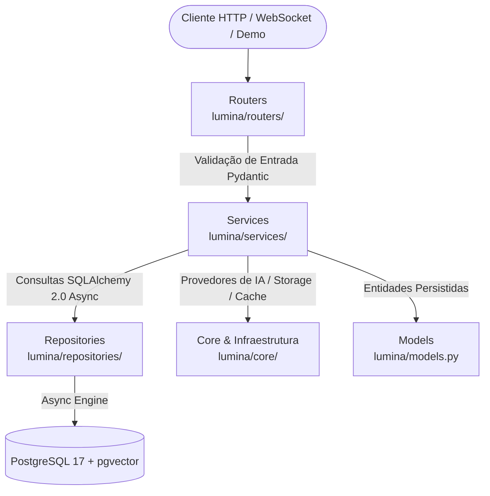
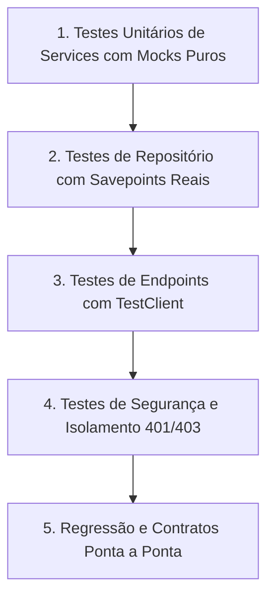
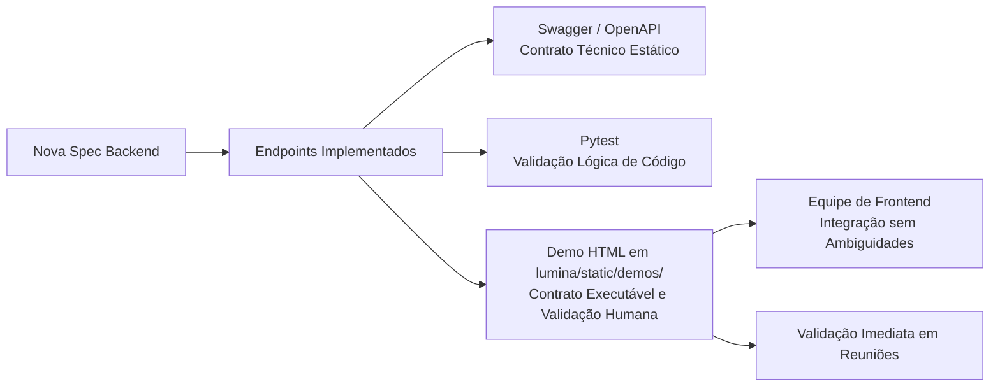

# Arquitetura & Engenharia

Este documento consolida os padrões de engenharia de software, arquitetura em camadas, metodologia de testes e diretrizes de construção de demos que governam o desenvolvimento do **Lumina Back**.

---

## 1. Arquitetura em Camadas (Service-Repository)

O backend adota o padrão de separação rígida de responsabilidades em camadas, garantindo isolamento de regras de domínio, testabilidade unitária e independência de fornecedores de infraestrutura.

### Detalhamento das Camadas:

* **Routers (`lumina/routers/`)**:
  * Recebem requisições HTTP e conexões WebSocket.
  * Validam contratos de entrada através de schemas Pydantic.
  * Injetam dependências (usuário logado, instâncias de services).
  * Retornam respostas com códigos de status adequados.
  * **Regra Rígida**: NUNCA contêm consultas SQL diretas, regras de negócio ou chamadas diretas a provedores de LLM.

* **Services (`lumina/services/`)**:
  * Orquestram todas as regras de domínio, validações de negócio e integrações externas.
  * Coordenam chamadas a repositórios, serviços de IA, storage (S3/local) e cache (Redis).
  * Lançam exceções de negócio e `HTTPException` quando apropriado.

* **Repositories (`lumina/repositories/`)**:
  * Encapsulam consultas SQLAlchemy 2.0 assíncronas puras (`AsyncSession`).
  * Aplicam filtros, joins, agregações e paginação.
  * Respeitam automaticamente a filtragem de exclusão lógica (`deleted_at.is_(None)`).
  * **Regra Rígida**: Repositórios NUNCA lançam `HTTPException`.

* **Models (`lumina/models.py`)**:
  * Entidades mapeadas via SQLAlchemy 2.0 com `Mapped` e `mapped_column`.
  * Todas as entidades de negócio herdam de `AuditMixin`, garantindo rastreamento de autoria (`created_by`, `updated_by`, `deleted_by`), datas (`created_at`, `updated_at`) e suporte a soft delete (`deleted_at`).

* **Schemas (`lumina/schemas/`)**:
  * Modelos de dados Pydantic utilizados para contratos de entrada, saída, filtros e serialização pública.

* **Features (`lumina/features/`)**:
  * Módulos autocontidos para domínios de maior complexidade (ex: `abnt_check/`, `template_check/`).
  * Cada feature encapsula seus próprios schemas, lógica de análise e templates de prompt, sendo orquestrada por um service correspondente.

* **Core (`lumina/core/`)**:
  * Infraestrutura transversal: engine de banco de dados (`database.py`), configurações via `pydantic-settings` (`settings.py`), autenticação JWT e criptografia de senhas (`security.py`), injeção de dependências (`dependencies.py`) e gerenciador de WebSockets (`cache.py`).

---

## 2. Metodologia de Testes Orientados a Risco

A confiabilidade da aplicação é assegurada por uma suíte de testes orientada a **risco e comportamento**, detalhada na skill `.agents/skills/fastapi-testing-methodology/SKILL.md`.

### As 5 Camadas da Pirâmide:
1. **Unitários de Services (`tests/unit/services/`)**: Validam lógica de negócio pura com mocks completos de repositórios (`AsyncMock`, `pytest-mock`). Execução instantânea.
2. **Integração de Repositórios (`tests/integration/repositories/`)**: Executam queries SQL reais contra PostgreSQL para validar joins, filtros e transações.
3. **API e Routers (`tests/api/routers/`)**: Exercitam requisições completas via `TestClient`, validando status codes, serialização e contratos.
4. **Segurança Transversal**: Validação explícita de recusa de acesso (401 Unauthorized e 403 Forbidden) para diferentes perfis e documentos.
5. **Regressão**: Garantia de que comportamentos corrigidos anteriormente permaneçam estáveis.

### Isolamento de Banco: Testcontainers & Savepoints
* Uma instância real de PostgreSQL 16 é provisionada uma única vez por sessão de testes via **Testcontainers**.
* O esquema DDL é aplicado no início da sessão.
* Cada teste roda dentro de uma transação aninhada (**Savepoint**); ao final do teste, um rollback é executado.
* **Regra Rígida**: NUNCA executar `create_all` ou `drop_all` em testes individuais.

### Separação em 3 Categorias de Testes com IA
Para impedir que a esteira de CI/CD fique lenta, cara ou suscetível a oscilações de rede externa:

| Categoria | Descrição | Consome Tokens? | Onde Executa? |
| :--- | :--- | :---: | :--- |
| **1. AI Integration** | Utiliza o `FakeListChatModel` do LangChain para simular respostas válidas da IA e validar o fluxo do backend. | Não | `poetry run task test` (CI/CD padrão) |
| **2. AI Contract** | Valida como os parsers e services reagem quando a LLM retorna saídas corrompidas ou fora do schema Pydantic esperado. | Não | `poetry run task test` (CI/CD padrão) |
| **3. AI Evaluation** | Executa inferências reais contra modelos externos utilizando datasets de teste padronizados (*golden datasets* em `tests/ai/evaluation/datasets/`). Decorados com `@pytest.mark.ai`. | Sim | `poetry run task test-ai` (Sob demanda local) |

* **Guardrail de Cobertura**: Mínimo de 80% de cobertura geral do código.

---

## 3. Segurança e Privacidade por Padrão

* **Autenticação**: Tokens JWT (`HS256`) com segredo robusto e hash de senhas via algoritmo **Argon2** (`pwdlib`).
* **Autorização Contextual**: Acesso a recursos controlado por matriz de permissões (`AccessType`: owner, advisor, viewer), validada em services antes de repassar chamadas ao repositório.
* **Exclusão Lógica Obrigatória (Soft Delete)**: Entidades com `AuditMixin` utilizam `deleted_at` e `deleted_by`. Exclusões físicas são expressamente vedadas em rotinas normais de negócio.
* **Trilha de Auditoria**: Operações críticas de mutação (CREATE, UPDATE, DELETE) geram registros imutáveis na tabela `audit_logs` via `audit_service`.
* **Proteção LGPD**: Dados pessoais sensíveis são anonimizados antes de qualquer envio a provedores externos de IA via Microsoft Presidio.

---

## 4. Guia de Demos HTML de Validação (Princípio VII)

Toda especificação (spec) que adicionar ou alterar comportamento observável no backend DEVE incluir uma **página HTML funcional de demonstração e validação**.

Esta página NÃO é um frontend de produto: trata-se de um artefato pragmático de validação, documentação viva e referência executável.

### Objetivos da Demo:
1. **Validação Manual Imediata**: Permitir que o desenvolvedor valide o fluxo ponta a ponta sem depender de Postman ou comandos curl complexos.
2. **Contrato Executável para o Frontend**: Serve de espelho funcional para os desenvolvedores de interface compreenderem os cabeçalhos, payloads de envio, respostas reais e fluxos de erro.
3. **Demonstração Executiva**: Permite demonstrar o valor de negócio em reuniões sem precisar esperar o frontend de produção.

### Diretrizes Técnicas de Construção:
* **Zero Build Step**: Construída estritamente com HTML5 semântico, estilos limpos (CSS vanilla ou Tailwind CSS via CDN) e JavaScript moderno (`fetch`, `async/await`). É PROIBIDO o uso de frameworks pesados (React, Vue, Angular) ou bundlers para páginas de demo.
* **Servida pelo Próprio FastAPI**: As demos residem em `lumina/static/demos/<nome-da-spec>/` e são servidas diretamente pelo FastAPI em `/demos/<nome-da-spec>/`. NUNCA crie servidores web ou processos paralelos.
* **Catálogo Central**: Toda nova demo deve ser listada com título e descrição no índice geral em `lumina/static/demos/index.html`.
* **Consumo Real**: A demo consome diretamente os endpoints reais da API em execução.
* **Autenticação e Personas**: A demo deve conter controles visuais para informar token JWT ou alternar rapidamente entre personas de teste (ex: Aluno, Orientador, Administrador).
* **Transparência Visual**:
  * Campos claros para parâmetros de entrada;
  * Botões autoexplicativos para disparar ações;
  * Indicador visual de processamento em andamento;
  * Exibição legível do status HTTP e payload JSON retornado;
  * Alerta visual explícito (etiquetas destacadas) em ações que persistam ou alterem dados reais no banco de dados.

### Desacoplamento Absoluto:
* A demo NÃO pode conter lógica de negócio no JavaScript; toda regra reside no backend.
* Nenhuma parte da aplicação de produção pode depender da existência da demo.
* A demo deve poder ser excluída a qualquer momento com zero impacto no sistema.
* NUNCA crie rotas inseguras ou contorne proteções de autenticação para facilitar a demo.

### Checklist de Definição de Concluído (DoD):
- [ ] Backend implementado e aderente à arquitetura em camadas.
- [ ] Testes automatizados cobrindo a matriz de risco.
- [ ] Página HTML de validação criada em `lumina/static/demos/<spec-name>/`.
- [ ] Card descritivo adicionado em `lumina/static/demos/index.html`.
- [ ] Página servida diretamente pela montagem `/demos/` do FastAPI.
- [ ] Fluxo de autenticação/personas funcionando na interface.
- [ ] Todos os critérios de aceitação exercitáveis manualmente pela página.
- [ ] Payloads de sucesso e de erro visíveis de forma clara.
- [ ] Resumo funcional documentado no MkDocs.
- [ ] Validação de zero acoplamento (a demo pode ser removida sem afetar o sistema).
