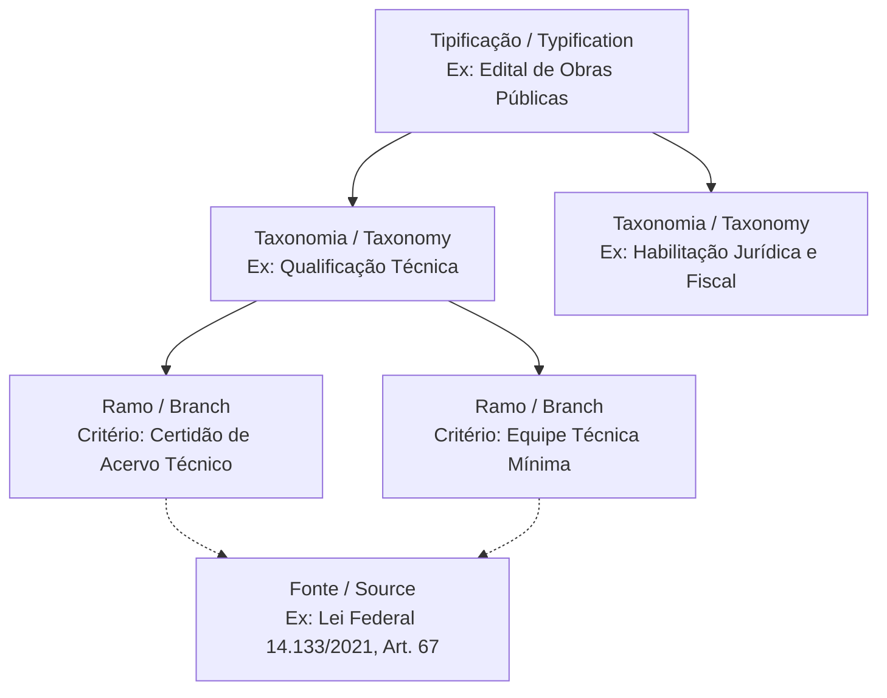
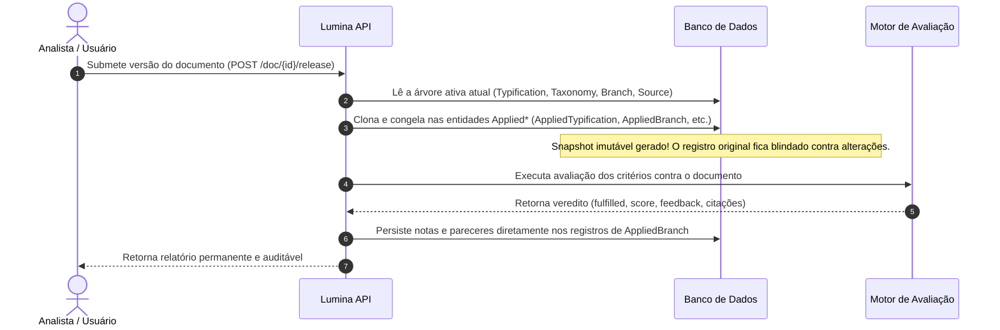
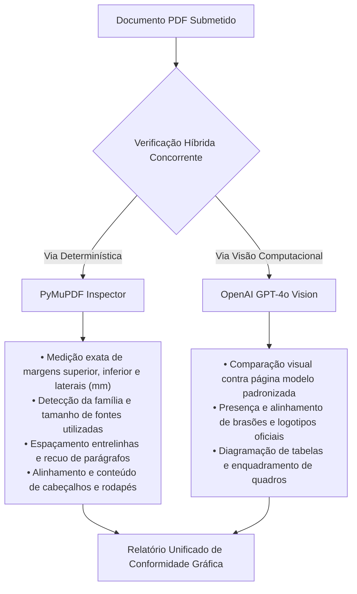

# Base de Conhecimento

A **Base de Conhecimento** (também denominada **Check Tree**) é a estrutura normativa que fundamenta todas as auditorias e análises documentais realizadas pelo Lumina Back. Ela organiza os requisitos legais, técnicos e regulatórios em uma árvore relacional configurável, permitindo que a inteligência artificial avalie documentos contra critérios objetivos e auditáveis.

---

## 1. Estrutura Hierárquica da Check Tree

A árvore de conhecimento é modelada em quatro níveis relacionais principais:

### Tipificação (`Typification`)
Define o perfil ou categoria do documento submetido para avaliação. Exemplos práticos:
* Edital de Contratação de Obras de Engenharia
* Pregão Eletrônico para Serviços de Tecnologia da Informação
* Artigo Científico / Trabalho de Conclusão de Curso
* Termo de Referência para Aquisições

### Taxonomia (`Taxonomy`)
Representa uma macro-seção ou tópico obrigatório previsto na estrutura documental do perfil. Exemplos:
* Condições de Participação e Impedimentos
* Habilitação Jurídica, Fiscal e Trabalhista
* Qualificação Econômico-Financeira
* Qualificação Técnica e Operacional
* Critérios de Julgamento e Proposta de Preços

### Ramo / Critério Normativo (`Branch`)
Constitui o critério específico que será avaliado pela inteligência artificial. Cada ramo possui:
* **Título e Descrição**: A definição normativa do que é exigido.
* **Pergunta de Verificação (`prompt_query`)**: A instrução exata enviada para a LLM (por exemplo: *"O documento exige comprovação de registro profissional no conselho competente da categoria?"*).
* **Peso / Score**: O peso relativo do critério na composição da nota global de conformidade da seção.

### Fonte Normativa (`Source`)
Representa o embasamento legal ou regulamentar que fundamenta a existência daquele critério. Exemplos:
* Lei Federal nº 14.133/2021 (Nova Lei de Licitações e Contratos Administrativos);
* Instruções Normativas da Secretaria de Gestão (SEGES/MGI);
* Normas Técnicas da ABNT (NBR 6023, NBR 14724).

---

## 2. Snapshots Imutáveis de Release (`Applied*`)

Em processos de auditoria documental e licitações públicas, a conformidade de uma versão do documento deve ser historicamente reprodutível. Se um edital foi analisado e aprovado com base na legislação de um determinado momento, eventuais alterações posteriores na árvore de critérios da plataforma não podem reescrever ou corromper os pareceres passados.

Por esse motivo, o Lumina implementa o padrão de **Snapshots Imutáveis de Release**:

### Entidades do Snapshot:
* **`AppliedTypification`**: Cópia estática do perfil documental com registro do ID original (`original_id`) e vínculo com a release (`applied_release_id`).
* **`AppliedTaxonomy`**: Cópia estática da macro-seção vinculada à tipificação congelada.
* **`AppliedBranch`**: Registro central da avaliação individual, armazenando:
  * `fulfilled`: Booleano indicando se o critério foi plenamente atendido.
  * `score`: Nota inteira de 0 a 10 calculada pela IA segundo o barema.
  * `feedback`: Parecer técnico detalhado explicando a análise e orientando ajustes.
  * `references`: Lista de coordenadas visuais (`rects`) e páginas correspondentes às evidências no PDF original.
  * `presidio_mapping`: Mapeamento de dados mascarados para desanonimização autorizada.
* **`AppliedSource`**: Cópia estática das fontes normativas vinculadas aos ramos e taxonomias da release.

---

## 3. Integridade Relacional e Soft Delete

Todas as entidades da Base de Conhecimento compartilham o `AuditMixin` do SQLAlchemy:
* **Exclusão Lógica**: Nenhuma entidade da árvore é excluída fisicamente do banco de dados. A operação de exclusão preenche `deleted_at` e `deleted_by`.
* **Filtragem Automática**: Repositórios filtram consultas com `deleted_at.is_(None)` para garantir que critérios excluídos não apareçam em novas análises.
* **Preservação de Vínculos**: Um critério excluído da árvore ativa continua preservado nos snapshots das releases anteriores que o utilizaram.

---

## 4. Módulos Especializados de Conformidade

Além da auditoria geral baseada na Check Tree, o Lumina possui módulos de negócios especializados para verificações padronizadas de formatação e leiaute.

### Verificação de Normas ABNT
O módulo `lumina/features/abnt_check/` valida trabalhos acadêmicos e relatórios técnicos segundo os parâmetros da Associação Brasileira de Normas Técnicas:
* **Citações Bibliográficas**: Conformidade do sistema autor-data (NBR 10520), diferenciando citações diretas curtas, citações diretas longas (com recuo de 4 cm) e citações indiretas.
* **Lista de Referências**: Formatação de referências bibliográficas ao final do texto segundo a NBR 6023 (destaque tipográfico, ordem alfabética e completude de metadados).
* **Elementos Estruturais**: Validação de elementos pré-textuais (folha de rosto, resumo, sumário) e pós-textuais.

### Verificação Híbrida de Templates
Para documentos que devem obedecer a um leiaute gráfico rígido (modelos institucionais padronizados, editais com cabeçalhos oficiais), o módulo `lumina/features/template_check/` implementa uma abordagem híbrida em duas vias concorrentes executadas via `asyncio.gather`:

A combinação de medições milimétricas em código estático com visão computacional multimodal elimina falsos positivos e garante tanto a exatidão métrica quanto a fidelidade visual da diagramação.
