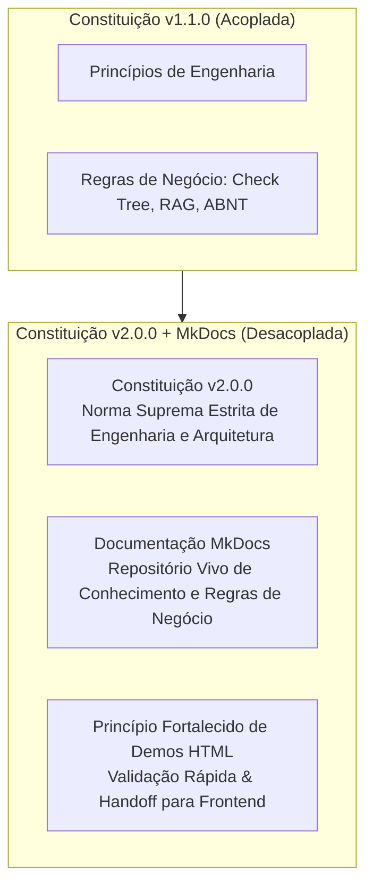

# Governança & Constituição

Este documento reúne os princípios normativos supremos do **Lumina Back**, o histórico de decisões arquiteturais e as diretrizes formais de evolução do projeto.

---

## 1. Constituição do Projeto (Versão 2.0.0)

> **Documento Normativo Supremo**  
> **Versão**: 2.0.0 | **Ratificada em**: 31/08/2026 | **Última Revisão**: 05/09/2026  
> **Arquivo Fonte**: [`.specify/memory/constitution.md`](https://github.com/meirelesgc/lumina-back/blob/develop/.specify/memory/constitution.md)

### Princípios Fundamentais (Core Principles)

#### I. Arquitetura em Camadas (Service-Repository)
Todo código de aplicação DEVE respeitar a separação rígida de responsabilidades em camadas bem delimitadas:
* **Routers** (`lumina/routers/`): Entrada HTTP e WebSockets, validação via Pydantic, injeção de dependências e serialização de saída. NUNCA contêm SQL, lógica de negócio ou chamadas diretas a LLMs.
* **Services** (`lumina/services/`): Orquestram a lógica de negócio, regras de domínio e chamadas externas (IA, storage, cache).
* **Repositories** (`lumina/repositories/`): Acesso e persistência via SQLAlchemy 2.0 assíncrono. NUNCA lançam `HTTPException`.
* **Models** (`lumina/models.py`): Entidades relacionais com `AuditMixin` (soft delete com `deleted_at`, timestamps e autoria).
* **Schemas** (`lumina/schemas/`): Contratos Pydantic de entrada e saída.
* **Features** (`lumina/features/`): Módulos autocontidos para domínios complexos e especializados.
* **Core** (`lumina/core/`): Infraestrutura transversal (engine, settings, security/JWT).

#### II. Inteligência Artificial Responsável e Engenharia de LLMs
A utilização de Modelos de Linguagem DEVE seguir rigorosas práticas de engenharia:
* **Anonimização LGPD Obrigatória**: Nenhum dado pessoal (PII) é enviado para LLMs externas ou vetorizado sem prévia anonimização via Microsoft Presidio.
* **Saídas Estruturadas (Structured Output)**: Validação estruturada obrigatória (Pydantic / JsonOutputParser) para garantir determinismo.
* **Centralização de Prompts**: Prompts em arquivos dedicados (`lumina/prompts.py` ou Jinja2), nunca hardcoded em classes de serviço.
* **Processamento Concorrente**: Execuções em lote (`abatch`) e assíncronas (`asyncio.gather`) para redução de custos e latência.
* **Rastreabilidade**: Metadados de modelo, temperatura, tokens e versão do prompt registrados para auditoria.

#### III. Testes Orientados a Risco (NON-NEGOTIABLE)
Suíte de testes focada em comportamento e criticidade:
* **Pirâmide de 5 Camadas**: Unitários de Services (mocks) -> Integração de Repositórios (savepoints) -> Routers e API (`TestClient`) -> Segurança (401/403) -> Regressão.
* **Isolamento com Testcontainers**: PostgreSQL com savepoints por teste (sem drop/create por teste).
* **Separação de IA nos Testes**:
  1. *AI Integration*: Mocks com `FakeListChatModel` em `poetry run task test`.
  2. *AI Contract*: Validação de resiliência de schemas em `poetry run task test`.
  3. *AI Evaluation*: Chamadas reais a LLMs com golden datasets, decoradas com `@pytest.mark.ai`, rodando somente em `poetry run task test-ai`.
* **Cobertura Mínima**: 80% geral.

#### IV. Simplicidade e Consistência de Código
* Limite de 79 caracteres por linha (PEP 8 / Ruff).
* Aspas simples `'` por padrão.
* Ruff como linter e formatador único.
* Tipagem estática integral em parâmetros e retornos.
* Poetry exclusivo (`poetry run`).
* Migrações automáticas via Alembic.

#### V. Segurança e Privacidade por Padrão
* Autenticação JWT (HS256) com senhas em Argon2 (`pwdlib`).
* Controle de acesso baseado em papéis documentais (`AccessType`: owner, advisor, viewer).
* Soft Delete obrigatório com filtro de `deleted_at.is_(None)`.
* Trilha de auditoria em `audit_logs`.

#### VI. Documentação Viva e Acessível no MkDocs (NON-NEGOTIABLE)
* **Grandes Mudanças**: Decisões arquiteturais, mudanças de governança e evolução de domínio DEVEM ser documentadas no MkDocs.
* **Linguagem Focada no Humano, Direta e Coesa**: Conteúdo claro, evitando jargões excessivos, com diagramas Mermaid e exemplos práticos.
* **Preservação de Domínio**: Regras de negócio da aplicação residem na documentação viva.
* **Sincronização com Specs**: Toda nova spec do Spec Kit deve gerar sua documentação funcional correspondente.
* **Zero Erros de Build**: Validado via `poetry run task docs-build`.

#### VII. Página HTML Funcional de Validação/Demo (NON-NEGOTIABLE)
Toda spec que altere ou adicione comportamento observável no backend DEVE incluir página HTML simples de validação em `lumina/static/demos/<spec-name>/`.
* **Zero Build Step**: HTML5, CSS simples e JavaScript vanilla (`fetch`, `async/await`), sem frameworks pesados de frontend.
* **Servida pelo FastAPI**: Montada em `/demos/<spec-name>/` com catálogo em `lumina/static/demos/index.html`.
* **Contrato Vivo e Handoff**: Serve como referência visual e executável para a equipe de frontend.
* **Consumo Real**: Dispara requisições contra os endpoints reais da API, suportando autenticação e personas de teste.
* **Desacoplamento Absoluto**: Zero lógica de negócio no frontend da demo e capacidade de ser removida sem afetar a produção.

---

## 2. Histórico de Decisões Arquiteturais

### [2026-09-05] — Constituição v2.0.0: Desacoplamento entre Governança e Regras de Negócio

#### Contexto e Motivação:
Até a versão 1.1.0, a Constituição do projeto acumulava diretrizes de governança técnica (camadas de software, pirâmide de testes) juntamente com estruturas de dados de domínio (como a hierarquia Tipificação -> Taxonomia -> Ramo da Check Tree) e fluxos particulares de IA (como fatiamento por coordenadas para PDFs).

Misturar regras de negócio na constituição causava dois problemas:
1. **Rigidez excessiva no domínio**: O modelo de dados de produto evolui à medida que novos tipos de documentos são suportados. Tratar essas regras como "constitucionais" exigia emendas formais desnecessárias a cada ajuste de negócio.
2. **Poluição da norma técnica suprema**: Agentes de IA e desenvolvedores tinham dificuldade de discernir o que era um princípio perene de engenharia e o que era apenas a regra de negócio de uma funcionalidade específica.

#### O que mudou:
* **Transferência do Domínio para a Documentação Viva**: Os detalhes da Check Tree, RAG com coordenadas e verificações de conformidade foram transferidos para as páginas temáticas correspondentes no MkDocs.
* **Consolidação dos Módulos**: A documentação foi estruturada em grandes módulos conceituais autoexplicativos, permitindo navegação profunda pelo sumário interno.
* **Fortalecimento das Demos HTML**: Aprofundamento do papel das páginas de demonstração como contratos vivos executáveis para o time de frontend.

---

## 3. Políticas de Emendas e Versionamento SemVer

Qualquer alteração na Constituição deve obedecer ao versionamento semântico:
* **MAJOR**: Remoção, redefinição incompatível de princípios ou alteração nos limites arquiteturais fundamentais.
* **MINOR**: Adição de novo princípio ou expansão material de orientações.
* **PATCH**: Clarificações de redação, correções ortográficas e refinamentos não-semânticos.

Toda alteração deve vir acompanhada do preenchimento do **Sync Impact Report** no cabeçalho do arquivo fonte [`.specify/memory/constitution.md`](file:///home/jaspion/Fiocruz/Lumina/lumina-back/.specify/memory/constitution.md).
