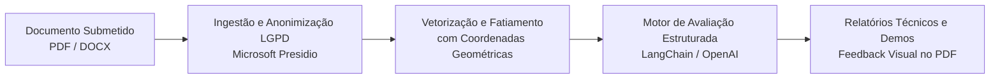

# Lumina Back — Documentação Técnica e Funcional

O **Lumina Back** é a API e motor de inteligência artificial desenvolvidos para apoiar a elaboração, revisão e auditoria normativa de documentos técnicos e acadêmicos complexos (como editais de compras públicas, chamadas públicas, artigos científicos e termos de referência).

A plataforma combina processamento determinístico, análise geométrica de arquivos PDF, proteção rigorosa de dados pessoais segundo a LGPD e modelos de linguagem estruturados para garantir precisão jurídica, rastreabilidade e eficiência operacional.

---

## Visão Geral do Sistema

O sistema analisa documentos submetidos, cruza seus conteúdos contra critérios normativos e legais cadastrados na base de conhecimento, e gera relatórios detalhados, indicando com exatidão se cada requisito foi atendido e apontando as evidências físicas no documento original.

---

## Módulos Principais da Documentação

A documentação está estruturada em cinco grandes módulos conceituais. Utilize o sumário lateral de cada página para navegar rapidamente entre os tópicos específicos:

| Módulo | Escopo e Conteúdo |
| :--- | :--- |
| [**Base de Conhecimento**](base-de-conhecimento.md) | Estrutura hierárquica normativa (Tipificação, Taxonomia, Ramo, Fonte), snapshots imutáveis de release (`Applied*`) e verificações especializadas de conformidade (ABNT e modelos de templates). |
| [**IA Dentro da Plataforma**](ia-plataforma.md) | Pipeline completo de IA: extração determinística de 4 estágios em memória (layout, seções, fatiamento monopágina e coordenadas), anonimização LGPD, embeddings no PGVector, pipeline de release (barema de 0 a 10) e chat RAG interativo. |
| [**Gestão de Orientadores e Orientandos**](orientacao-academica.md) | Modelo de supervisão acadêmica, isolamento multi-tenant de dados, vínculos de orientação, escopos de visualização documental (`mine`, `advisees`, `all`) e matriz de permissões. |
| [**Arquitetura & Engenharia**](arquitetura-engenharia.md) | Separação em camadas (Service-Repository), estratégia de testes orientados a risco (pirâmide de 5 camadas e as 3 categorias de IA), segurança (JWT, Argon2, Soft Delete) e padrão de Demos HTML de validação. |
| [**Governança & Constituição**](governanca.md) | Texto integral da Constituição do Projeto (v2.0.0), histórico de decisões arquiteturais, diretrizes operacionais e políticas de versionamento SemVer. |
