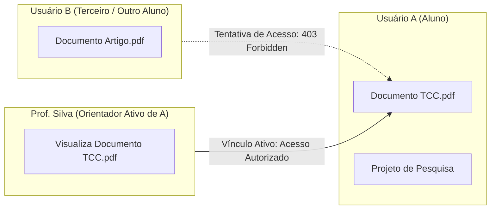

# Gestão de Orientadores e Orientandos

O módulo de **Gestão de Orientadores e Orientandos** (Advisorship) implementa o modelo de colaboração acadêmica e controle de acesso contextual do Lumina Back. Ele permite que orientadores e coorientadores acompanhem, revisem e auditem os trabalhos desenvolvidos por seus orientandos sem comprometer o isolamento de dados e a privacidade perante terceiros.

O código correspondente está localizado em:
* Rota: [`lumina/routers/advisorship.py`](file:///home/jaspion/Fiocruz/Lumina/lumina-back/lumina/routers/advisorship.py)
* Serviço: [`lumina/services/advisorship_service.py`](file:///home/jaspion/Fiocruz/Lumina/lumina-back/lumina/services/advisorship_service.py)

---

## 1. Princípio do Isolamento de Dados por Padrão

Em um ambiente acadêmico ou corporativo com múltiplos usuários, a privacidade é um requisito inegociável de segurança:



* **Privacidade Padrão**: Todo documento ou projeto criado por um usuário pertence exclusivamente a ele (`created_by`).
* **Bloqueio a Terceiros**: Qualquer usuário não autorizado que tente consultar diretamente um documento (`GET /doc/{id}`) ou projeto alheio recebe o status HTTP `403 Forbidden`.
* **Sem Vazamento em Listagens**: Consultas de listagem (`GET /doc` ou `GET /project`) retornam estritamente os registros do próprio usuário quando nenhum escopo compartilhado é informado.

---

## 2. Vínculos de Orientação e Ciclo de Vida

O relacionamento entre orientador e orientando é gerenciado pela entidade `Advisorship`.

### Papéis Suportados:
* `MAIN_ADVISOR`: Orientador principal responsável pela supervisão direta;
* `CO_ADVISOR`: Coorientador com permissões equivalentes de leitura e emissão de pareceres.

### Ciclo de Vida do Vínculo:
* `ACTIVE`: Vínculo plenamente ativo. O orientador visualiza os documentos e projetos do orientando.
* `COMPLETED`: Trabalho acadêmico concluído e defendido.
* `CANCELLED`: Vínculo interrompido.

**Regra de Bloqueio Imediato**: Quando um vínculo de orientação é alterado para `CANCELLED` ou `COMPLETED`, o ex-orientador perde imediatamente o acesso aos novos documentos do pesquisador. Qualquer tentativa de consulta subsequente retorna `403 Forbidden`.

---

## 3. Matriz de Escopos de Consulta (`scope`)

O endpoint de listagem de documentos (`GET /doc`) aceita o parâmetro de consulta `scope` para alternar a visão do usuário:

| Valor do Parâmetro | Comportamento da API | Público Alvo |
| :--- | :--- | :--- |
| `scope=mine` *(padrão)* | Retorna exclusivamente os documentos criados pelo usuário autenticado ou onde ele consta na lista de editores diretos. | Alunos, Pesquisadores e Orientadores consultando trabalhos próprios. |
| `scope=advisees` | Retorna os documentos pertencentes a alunos que possuem vínculo de orientação ativo com o usuário logado. | Orientadores revisando a produção de seus orientandos. |
| `scope=all` | Retorna a união dos documentos próprios e dos orientandos ativos. Se o usuário possuir `access_level=ADMIN`, retorna todos os documentos do sistema. | Orientadores em visão consolidada e Administradores da plataforma. |
| `advisee_id=<UUID>` | Filtra os documentos de um orientando específico sob supervisão do orientador. | Orientadores acompanhando um projeto individual. |

---

## 4. Proteção contra Mutações Indevidas

O vínculo de orientação concede permissão de **leitura, auditoria e colaboração**, mas não transfere a titularidade da autoria:

* **Operações de Escrita Restritas**: Atualizações de metadados (`PUT /doc`) e exclusões (`DELETE /doc/{id}`) são restritas ao criador original (`created_by`) ou a editores com delegação explícita.
* **Orientador como Revisor**: O orientador pode submeter mensagens no chat de revisão, consultar notas do barema e inspecionar os relatórios de release, mas não pode deletar os documentos do orientando.

---

## 5. Endpoints do Módulo de Orientação

```http
POST /advisorship
```
Cria um novo vínculo de orientação entre `advisor_id` e `advisee_id`, definindo o papel (`MAIN_ADVISOR` ou `CO_ADVISOR`), tópico e status inicial. Rejeita auto-orientação (`advisor_id == advisee_id`) com `400 Bad Request` e duplicidade de vínculos ativos com `409 Conflict`.

```http
GET /advisorship/my-advisees
```
Retorna a lista de orientandos ativos associados ao orientador logado.

```http
GET /advisorship/my-advisors
```
Retorna a lista de orientadores ativos associados ao aluno/orientando logado.

```http
GET /advisorship/documents/{doc_id}/academic-context
```
Retorna o contexto acadêmico unificado do documento: autor original, orientador principal, coorientadores ativos e projeto de pesquisa vinculado.

---

## 6. Página de Demonstração Interativa

Em conformidade com a Constituição do Lumina (Princípio VII), o módulo possui uma página HTML funcional dedicada para testes manuais e demonstração do isolamento:
* **Rota**: `/demos/advisorship/`
* **Funcionalidade**: Permite alternar instantaneamente entre diferentes personas (Aluno A, Aluno B, Orientador, Terceiro sem vínculo e Administrador) e validar visualmente as respostas `200 OK` e os bloqueios `403 Forbidden` diretamente no navegador.
