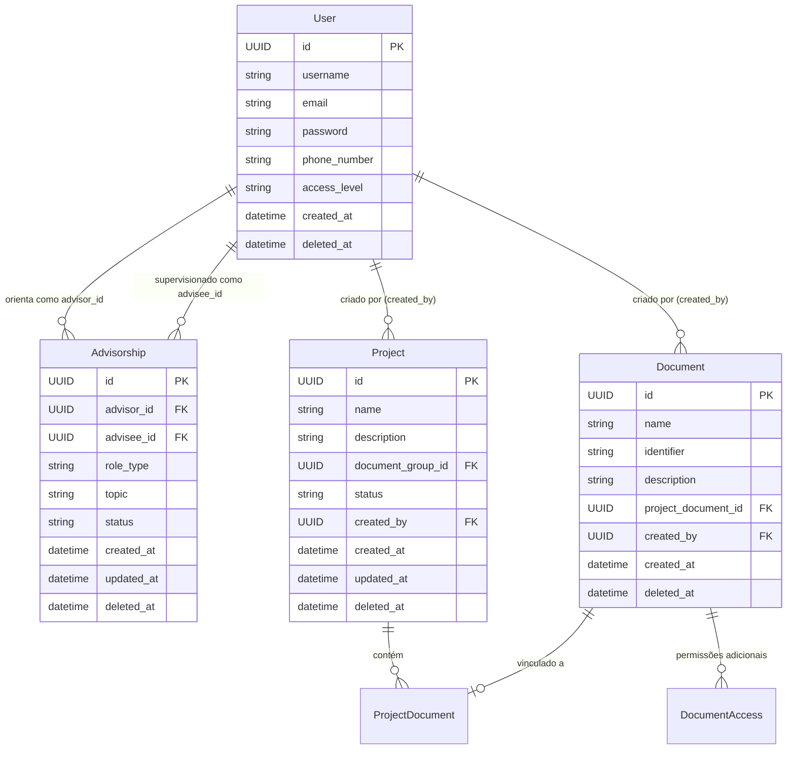

# Data Model: Advisorship and Entity Access Control

## Overview

O modelo de dados de controle de acesso e orientação do Lumina Back estabelece relações de posse, supervisão acadêmica e compartilhamento controlado de recursos (Projetos e Documentos).

## Entities & Relationships

## Field Specifications & Validation Rules

### Advisorship
- `advisor_id` (UUID, obrigatório): ID do usuário com papel de orientador.
- `advisee_id` (UUID, obrigatório): ID do usuário com papel de orientando.
  - *Regra*: `advisor_id != advisee_id` (auto-orientação proibida).
- `role_type` (Enum: `MAIN_ADVISOR`, `CO_ADVISOR`): Tipo do vínculo acadêmico.
- `topic` (String, opcional): Tema da pesquisa/orientação.
- `status` (Enum: `ACTIVE`, `COMPLETED`, `CANCELLED`): Estado do vínculo.
  - *Regra*: Somente vínculos com status `ACTIVE` concedem acesso a documentos e projetos.

### Project
- `id` (UUID): Identificador único.
- `name` (String, obrigatório, único por tenant): Nome do projeto.
- `description` (String, opcional): Descrição detalhada.
- `document_group_id` (UUID, opcional): Grupo temático associado.
- `created_by` (UUID FK User, via `AuditMixin`): Usuário criador/proprietário do projeto.
- `deleted_at` (Datetime, nullable): Timestamp para soft delete.

## Access Resolution Matrix

| Persona | Relação com Recurso | Acesso a `/doc` | Acesso a `/project` | Mutação (PUT/DELETE) |
|---|---|---|---|---|
| **Proprietário** | `created_by == user.id` | Leitura Total | Leitura Total | Permitido |
| **Editor Explícito** | `DocumentAccess(user_id, EDITOR)` | Leitura e Edição | N/A | Permitido (Documento) |
| **Orientador Ativo** | `Advisorship(advisor, advisee, ACTIVE)` | Leitura (`scope=advisees`/`all` ou por ID) | Leitura (projetos do orientando) | Bloqueado (403) |
| **Ex-Orientador** | `Advisorship(..., CANCELLED)` | Bloqueado (403) | Bloqueado (403) | Bloqueado (403) |
| **Terceiro/Desconhecido** | Sem vínculo de posse ou orientação | Bloqueado (403) | Bloqueado (403) | Bloqueado (403) |
| **Administrador** | `access_level == ADMIN` | Leitura Total (`scope=all`) | Leitura Total | Permitido |
