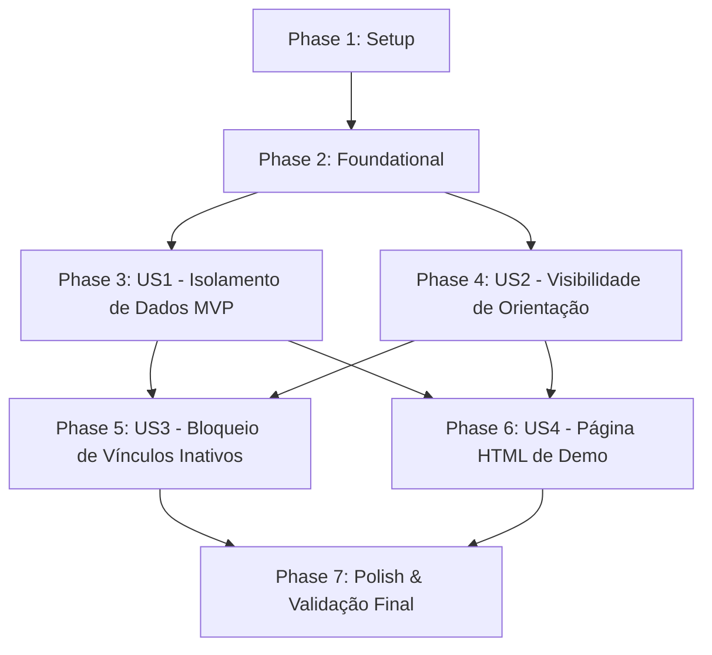

# Tasks: Advisorship and Entity Access Control

**Feature**: Advisorship and Entity Access Control
**Branch**: `001-advisorship-access-control`
**Spec**: [spec.md](./spec.md) | **Plan**: [plan.md](./plan.md)

---

## Phase 1: Setup

**Purpose**: Estrutura inicial e preparação do ambiente de desenvolvimento

- [x] T001 Setup demo directory structure at `lumina/demos/advisorship/`
- [x] T002 [P] Verify static mount and test fixtures configuration in `lumina/app.py` and `tests/conftest.py`

---

## Phase 2: Foundational (Blocking Prerequisites)

**Purpose**: Infraestrutura de sessão que desbloqueia todas as histórias de usuário

**⚠️ CRITICAL**: Nenhuma história de usuário pode ser finalizada sem a injeção adequada de sessão nas rotas.

- [x] T003 Injetar `CurrentUser` nos endpoints de leitura e listagem em `lumina/routers/check_tree/projects.py`
- [x] T004 [P] Injetar `CurrentUser` nos endpoints de documentos de projetos em `lumina/routers/check_tree/project_documents.py`

**Checkpoint**: Rotas preparadas para receber a sessão do usuário autenticado.

---

## Phase 3: User Story 1 - Isolamento de Dados por Usuário Padrão (Priority: P1) 🎯 MVP

**Goal**: Garantir que contas recém-criadas ou sem vínculos visualizem apenas seus próprios projetos e documentos, eliminando vazamentos de dados de terceiros.

**Independent Test**: Criar `Usuário A` e `Usuário B`. `Usuário A` cria projetos e documentos. `Usuário B` lista seus projetos/documentos e não vê nada de `Usuário A`. Acesso direto por ID retorna 403 Forbidden.

### Tests for User Story 1
- [x] T005 [P] [US1] Integration tests for project isolation and unauthorized access blocking in `tests/integration/test_project_access_control.py`

### Implementation for User Story 1
- [x] T006 [US1] Update `lumina/repositories/project_repo.py` to filter projects by `created_by == user_id`
- [x] T007 [US1] Update `lumina/services/project_service.py` to enforce `user_id` ownership on `get_projects` and `get_project_by_id`
- [x] T008 [US1] Update `lumina/services/project_document_service.py` to validate project ownership before returning project documents

**Checkpoint**: User Story 1 (MVP) concluída — Isolamento total entre contas independentes.

---

## Phase 4: User Story 2 - Visibilidade Compartilhada por Vínculo Ativo de Orientação (Priority: P1)

**Goal**: Permitir que orientadores com vínculo ativo visualizem e acessem os projetos e documentos dos seus orientandos sob supervisão acadêmica.

**Independent Test**: Criar `Orientador` e `Orientando` com vínculo `status=ACTIVE`. `Orientador` deve listar projetos do orientando e acessar documentos por ID com sucesso.

### Tests for User Story 2
- [x] T009 [P] [US2] Integration tests for advisor-advisee project and document sharing in `tests/integration/test_project_access_control.py`

### Implementation for User Story 2
- [x] T010 [US2] Implement advisor visibility logic for advisee projects in `lumina/services/project_service.py` and `lumina/repositories/project_repo.py`
- [x] T011 [US2] Implement academic context lookup integration in `lumina/services/advisorship_service.py`

**Checkpoint**: User Stories 1 e 2 funcionais — Orientador supervisiona orientando com segurança.

---

## Phase 5: User Story 3 - Bloqueio Automático em Vínculos Inativos ou Cancelados (Priority: P2)

**Goal**: Revogar imediatamente o acesso de leitura de ex-orientadores quando o vínculo de orientação for cancelado ou inativado.

**Independent Test**: Cancelar o vínculo de orientação (`status=CANCELLED`). O ex-orientador deixa de listar projetos do aluno e recebe 403 Forbidden ao consultar por ID.

### Tests for User Story 3
- [x] T012 [P] [US3] Integration tests for access revocation on cancelled advisorships in `tests/integration/test_project_access_control.py`

### Implementation for User Story 3
- [x] T013 [US3] Enforce active status (`status == 'ACTIVE'`) verification in `lumina/repositories/project_repo.py` and `lumina/services/project_service.py`

**Checkpoint**: Revogação de acesso validada e blindada contra regressões.

---

## Phase 6: User Story 4 - Demonstração Visual e Validação Manual (Priority: P2)

**Goal**: Criar a página HTML funcional de validação interativa em `/demos/advisorship/` atendendo ao Princípio VIII da Constituição.

**Independent Test**: Abrir `/demos/advisorship/` no navegador, alternar entre Aluno, Orientador e Terceiro, e verificar os retornos reais da API na interface.

### Implementation for User Story 4
- [x] T014 [US4] Create interactive HTML validation page in `lumina/demos/advisorship/index.html` with persona switching (Aluno, Orientador, Terceiro)
- [x] T015 [US4] Implement direct REST API client in `lumina/demos/advisorship/index.html` for login, project listing, document listing, and 403 status inspection
- [x] T016 [US4] Update `lumina/demos/index.html` hub to include a navigation link to `/demos/advisorship/`

**Checkpoint**: Demonstração interativa operacional para reuniões, frontend e validação manual.

---

## Phase 7: Polish & Cross-Cutting Concerns

**Purpose**: Qualidade final, garantia de não-regressão e documentação

- [x] T017 Run full test suite with `poetry run task test` to ensure zero regressions
- [x] T018 Execute manual end-to-end scenario validation using `specs/001-advisorship-access-control/quickstart.md`
- [x] T019 [P] Update functional feature overview in `docs/`

---

## Dependencies & Execution Order

### Parallel Opportunities

- **Phase 1**: T001 e T002 podem ser executados em paralelo.
- **Phase 2**: T003 e T004 podem ser executados em paralelo.
- **Testes & Serviços**: T005, T009 e T012 (testes de integração) podem ser desenvolvidos em paralelo antes dos ajustes de services.
- **Demo HTML**: T014 e T015 podem ser desenvolvidos independentemente enquanto os testes backend são executados.

---

## Implementation Strategy

1. **MVP First**: Implementar T001-T008 (Setup + Foundational + User Story 1). Validar que nenhuma conta nova recebe projetos de terceiros.
2. **Supervisão Acadêmica**: Implementar T009-T013 (User Stories 2 e 3). Validar compartilhamento controlado entre orientador e orientando.
3. **Demo & Validação Visual**: Implementar T014-T016 (User Story 4). Servir `/demos/advisorship/` para testes manuais e demonstração.
4. **Fechamento**: Executar T017-T019 (`task test` e validação do `quickstart.md`).
